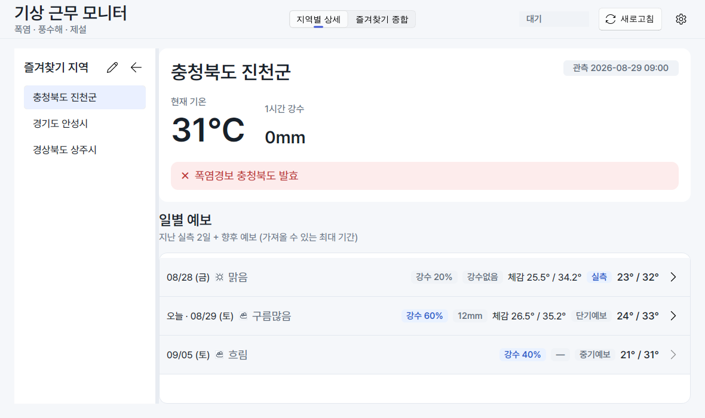
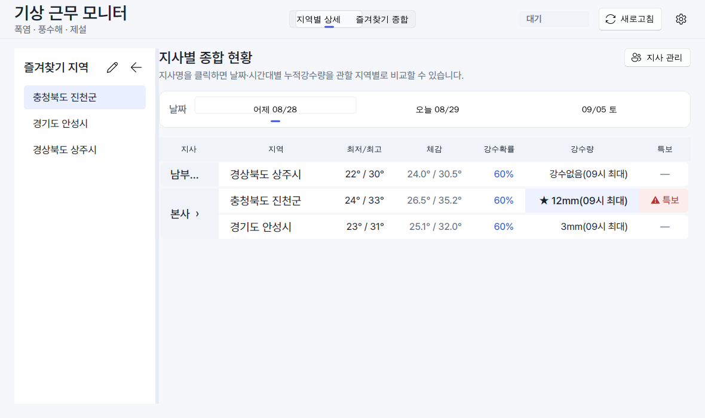

# weather-duty

폭염·풍수해·제설 근무를 위한 지역별 날씨 모니터. 서버 없이 로컬에서 실행하는
데스크톱 프로그램(파이썬 + PySide6/Qt + [PySide6-Fluent-Widgets](https://github.com/zhiyiYo/PyQt-Fluent-Widgets))으로,
기상청(공공데이터포털) API를 직접 호출한다. 화면은 절제된 톤의 자체 디자인 토큰
체계("Calm Operations Dashboard", `weather_duty/theme.py`)를 따르고, Pretendard
번들 폰트로 라이트·다크 모드를 지원한다.

## 화면

| 지역별 상세 | 즐겨찾기 종합 |
| --- | --- |
|  |  |

(위 화면은 실제 기상청 API 응답이 아니라 목(mock) 데이터로 만든 예시입니다.)

## 기능

- 전국 시군구(250개) 중 검색해서 즐겨찾기 추가 — 특정 읍/면/동까지 필요하면
  위도/경도를 직접 입력해 추가 가능
- 지역별 현재 기온 / 1시간 강수량 (초단기실황)
- 향후 예보: 단기예보(오늘~모레, 최저·최고기온/강수확률/강수량/하늘상태) +
  중기예보(3~10일 후, 최저·최고기온/강수확률/날씨)를 이어붙여 **가져올 수 있는
  최대 기간까지** 표시
- 지난 2일치 확정 실측 자료(지상 종관 ASOS 시간자료): 주말 등이 지난 뒤 보고에
  쓸 수 있도록, 예보가 아니라 이미 관측이 끝난 최저/최고기온·누적강수량을 표시.
  시간별 실측값도 함께 가져오므로 단기예보와 동일하게 시간별 상세(3시간 단위
  아닌 매시 단위) 팝업과 지사별 시간대 비교에서도 지난 2일을 선택할 수 있음
- 기상특보 발효 현황 (당일 기준만 제공되며, 특보는 미래일에는 표시되지 않음 — 공란).
  즐겨찾기가 여러 지방기상청 관할에 걸쳐 있어도 관할별로 나눠 조회하므로 누락 없음
- 즐겨찾기 종합보기의 누적강수량 칸에 최다 강수 시각도 함께 표시(예: `67mm(12시 최대)`)
- 즐겨찾기 지역 관리: 상시 표출할 지역을 선택/편집

## 지역 데이터 출처

- 시군구 중심 좌표(전국 250개): 공개된 행정구역 중심점 데이터(`datainworld/administrative_district`,
  EUC-KR CSV, WGS84)를 UTF-8로 옮기고 시도명을 붙였다 (`weather_duty/data/sigungu.csv`).
- 위경도 -> 기상청 격자좌표(nx, ny) 변환: 기상청이 공개 배포하는 LCC 변환 공식을
  그대로 구현했다 (`weather_duty/grid.py`). 서울시청(37.5665, 126.9780) 등 잘 알려진
  기준점으로 결과를 검증함(60, 127 등 공식 예시값과 일치).
- 중기기온(getMidTa) 지역코드(193개 지점): 위경도로 가장 가까운 지점을 찾아 매칭
  (`weather_duty/data/midterm_ta_points.csv`).
- 중기육상예보(getMidLandFcst) 지역코드(10개 광역권역: 수도권/강원영서/강원영동/
  충북/대전세종충남/전북/광주전남/대구경북/부산울산경남/제주): 시도명 기준으로 결정.
- 지상(종관, ASOS) 시간자료 관측지점번호(stnId, 현재 운영 중인 97개 지점): 기상자료
  개방포털에서 받은 관측지점정보 메타데이터의 위경도로 가장 가까운 지점을 매칭
  (`weather_duty/data/asos_stations.csv`).

시군구 중심 좌표만으로는 같은 시군구 안의 특정 읍/면/동까지는 정확히 짚지 못한다.
더 세밀한 위치가 필요하면 "즐겨찾기 편집 > 위도/경도로 직접 추가"에서 원하는
지점의 위도/경도를 입력해 사용자 정의 지역으로 추가하면 된다(위경도는 구글맵 등
지도에서 위치를 우클릭하면 확인 가능).

## 폰트

애플 시스템 폰트(SF Pro)와 비슷한 느낌을 내면서도 어느 OS에나 자유롭게 배포할 수
있도록 [Pretendard](https://github.com/orioncactus/pretendard)(OFL 라이선스)를
`weather_duty/assets/fonts/`에 번들로 포함했다. 라이선스 전문은 같은 폴더의
`LICENSE.txt`에 있다.

## 라이선스 안내

카드/세그먼트 컨트롤/토스트 알림 등 위젯 디자인에 쓰는 `PySide6-Fluent-Widgets`
(qfluentwidgets) 패키지는 **GPLv3** 라이선스다. PySide6 자체는 LGPL로 상용
재배포도 자유롭지만, qfluentwidgets가 들어간 이상 이 프로그램을 제3자에게
실행파일(exe) 형태로 배포할 경우 GPLv3 조건(요청 시 소스코드 제공 등)이 적용된다.
같은 기관 내부 업무용으로만 쓴다면 실무상 문제될 일은 거의 없지만, 외부 배포를
고려한다면 참고하자.

## 필요한 공공데이터포털 API (인증키 신청 필요)

아래 4개를 **모두** [data.go.kr](https://www.data.go.kr) 에서 "활용신청" 해야
하나의 서비스키로 전부 사용할 수 있다 (일반적으로 같은 계정 키가 승인 후
공통으로 적용됨).

1. **기상청_단기예보 ((구)동네예보) 조회서비스** (`VilageFcstInfoService_2.0`)
   - 초단기실황조회 `getUltraSrtNcst`, 단기예보조회 `getVilageFcst`
2. **기상청_중기예보 조회서비스** (`MidFcstInfoService`)
   - 중기기온조회 `getMidTa`, 중기육상예보조회 `getMidLandFcst`
3. **기상청_기상특보 조회서비스** (`WthrWrnInfoService`)
   - 특보발표현황조회 `getWthrWrnMsg`
4. **기상청_지상(종관, ASOS) 시간자료 조회서비스** (`AsosHourlyInfoService`) — **신규,
   과거 2일 확정 실측 자료(시간별 포함) 표시를 위해 추가로 신청 필요**
   - 시간자료조회 `getWthrDataList`

신청 후 승인되면 **일반 인증키(Decoding)** 값을 프로그램의 "설정(서비스키)"
화면에 입력하면 된다.

### 기상특보 관련 한계

`getWthrWrnMsg`의 `stnId`는 관측지점번호가 아니라 발표 관서(지방기상청) 코드다.
한 지방기상청은 자기 관할 구역 특보만 내려주므로(예: 대구지방기상청은 대구·경북
특보만), 즐겨찾기 지역이 걸쳐 있는 관할 지방청마다 따로 조회한다(9개 권역 -
`weather_duty/regions.py`의 `warn_stn_id`). 그 관서 관할 안에서 특정 시군구가
실제로 해당 특보 대상인지는 구조화된 지역코드가 아니라 자유 텍스트(제목/내용)로
내려오므로, 지역명이 그 텍스트에 포함되는지로 매칭한다(단순 키워드 매칭). 더
정교하게 하려면 기상청이 제공하는 특보구역코드표를 이용해 구조화된 매칭으로
바꿀 수 있다 — 필요하면 알려주면 추가로 구현 가능.

## 실행 방법 (뭘 누르면 되나요?)

**사전 준비 (최초 1회만):** [python.org](https://www.python.org/downloads/)에서
Python 3를 설치한다. Windows 설치 화면에서 **"Add python.exe to PATH"** 체크박스를
반드시 체크한다. GUI 라이브러리(PySide6/Qt)는 `requirements.txt`를 통해 자동으로
설치되며, 필요한 Qt 런타임을 자체적으로 포함하고 있어 따로 설치할 것은 없다.

그 다음부터는 아래 파일을 **더블클릭**하면 된다.

| OS | 더블클릭할 파일 |
| --- | --- |
| Windows | `run.bat` |
| macOS | `run.command` (최초 실행 시 "확인 없이 열기" 허용 필요할 수 있음) |

실행하면 검은 콘솔 창이 잠깐 뜨면서 필요한 라이브러리를 자동 설치한 뒤
프로그램 창이 뜬다. 처음 실행 시에는 프로그램 안의 **"설정(서비스키)"** 버튼을
눌러 공공데이터포털에서 받은 서비스키를 입력해야 데이터가 표시된다.

### Python 설치 없이 배포하고 싶다면 (완전한 .exe로 묶기)

담당자 PC마다 Python을 설치하기 번거롭다면, 아래 스크립트를 **한 번만** 실행해
Python 없이도 바로 실행되는 단일 실행파일을 만들 수 있다. 이 스크립트 자체는
Python이 설치된 PC에서 실행해야 하지만, 결과물(`WeatherDuty.exe`)은 다른
Windows PC에 Python 없이 그대로 복사해서 쓸 수 있다.

| OS | 더블클릭할 파일 | 결과물 |
| --- | --- | --- |
| Windows | `build_exe.bat` | `dist\WeatherDuty.exe` |
| macOS/Linux | `build_exe.sh` | `dist/WeatherDuty` |

> PyInstaller는 빌드한 OS용 실행파일만 만든다 (예: Mac에서 빌드하면 Mac용만
> 생성됨). Windows 배포용 exe가 필요하면 반드시 Windows PC에서 빌드해야 한다.

### 터미널에 익숙하다면

```bash
pip install -r requirements.txt
python main.py
```

`requirements.txt`는 느슨한 최소 버전(`>=`)만 정한다. 특정 문제를 재현하거나
CI/배포 빌드처럼 "이 조합에서 동작을 확인했다"는 정확한 기준이 필요하면
`requirements-lock.txt`(실제 설치 상태를 `pip freeze`로 그대로 옮긴 전체
고정 버전 목록)를 대신 쓴다: `pip install -r requirements-lock.txt`.

## 설정 파일 위치

서비스키와 즐겨찾기 목록은 홈 디렉터리 아래에 저장되며(`~/.weather_duty/config.json`,
`~/.weather_duty/custom_regions.json`) 리포지토리에는 포함되지 않는다.

## 테스트

API 파싱 로직에 대한 단위 테스트(모킹, 네트워크 불필요):

```bash
python -m unittest discover -s weather_duty/tests -v
```
